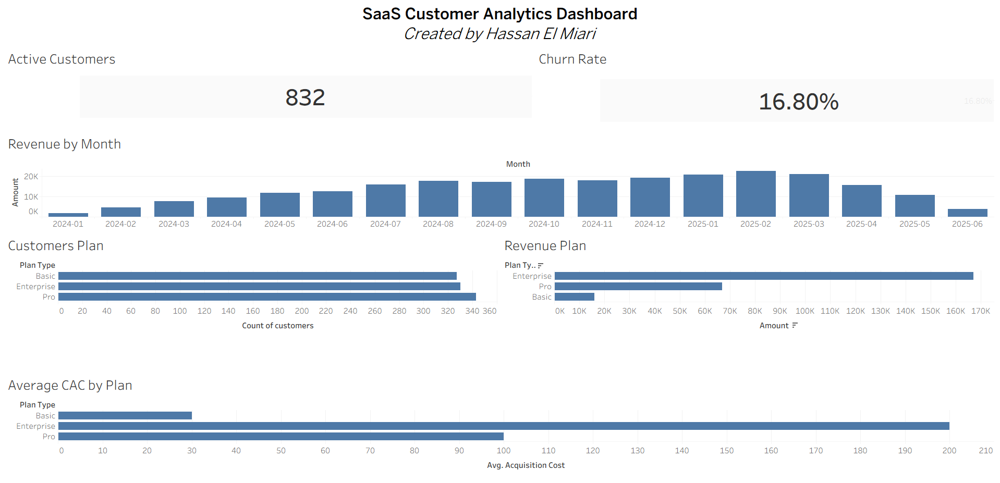

# SaaS Customer Analytics Dashboard

## Project Overview

This project analyzes customer and revenue performance for a Software-as-a-Service (SaaS) company using SQL and Tableau. The goal is to transform raw business data into actionable insights through KPI analysis and interactive visualizations.

The dashboard provides a comprehensive overview of customer activity, churn rate, revenue trends, subscription plan performance, and customer acquisition costs.

---

## Objectives

* Analyze customer and revenue data using SQL
* Calculate key SaaS business metrics
* Build an interactive Tableau dashboard
* Identify revenue and customer behavior trends
* Support data-driven business decisions

---

## Tools Used

* MySQL
* Tableau Public
* SQL
* CSV Datasets

---

## Datasets

### Customers

Contains customer information including:

* Customer ID
* Plan Type
* Signup Date
* Churn Date
* Acquisition Cost
* Monthly Fee

### Revenue

Contains revenue transaction records including:

* Customer ID
* Subscription ID
* Revenue Type
* Amount
* Month

---

## SQL Analysis

The following SQL queries were created to generate business insights:

### Total Revenue

Calculates total company revenue.

### Active Customers

Counts customers with no churn date.

### Churn Rate

Calculates the percentage of churned customers.

### Revenue by Month

Tracks revenue trends over time.

### Customers by Plan

Counts customers within each subscription plan.

### Active Customers by Plan

Measures active customers across subscription plans.

### Revenue by Plan

Calculates revenue contribution by each plan.

### Average CAC by Plan

Measures average customer acquisition cost by subscription plan.

---

## Dashboard Components

### KPI Cards

* Active Customers
* Churn Rate

### Revenue Analysis

* Revenue by Month
* Revenue by Plan

### Customer Analysis

* Customers by Plan
* Active Customers by Plan

### Cost Analysis

* Average Customer Acquisition Cost (CAC) by Plan

---

## Key Findings

* Total Revenue: **249,800**
* Active Customers: **832**
* Churn Rate: **16.8%**
* Enterprise plan generated the highest revenue (**167,000**)
* Pro plan had the highest customer count (**343**)
* Enterprise plan recorded the highest acquisition cost
* Revenue increased steadily throughout 2024 and peaked during early 2025 before declining

---

## Dashboard Preview



---

## Project Structure

```text
SaaS-Customer-Analytics-Dashboard/
│
├── README.md
├── Report.pdf
├── Dashboard.png
│
├── SQL/
│   ├── total_revenue.sql
│   ├── active_customers.sql
│   ├── churn_rate.sql
│   ├── revenue_by_month.sql
│   ├── customers_by_plan.sql
│   ├── active_customers_by_plan.sql
│   ├── revenue_by_plan.sql
│   └── average_cac_by_plan.sql
│
├── Dataset/
│   ├── customers.csv
│   └── revenue.csv
│
└── Tableau/
    └── SaaS_Customer_Analytics_Dashboard.twb
```

## Author

**Hassan El Miari**

Management Information Systems Graduate
Data Analytics Intern
Tableau | SQL | Power BI

---

*Created as part of a Data Analytics Internship Project.*
